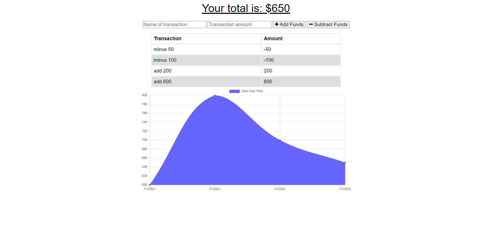

# Budget Tracker
## Link to deployed Heroku app
https://young-atoll-56024.herokuapp.com/
## Description
This is an app dedicated to tracking your spending over time. You can either add or subtract funds and give names to those transactions. This app will display a visual representation of your deposits and withdrawals in the form of a chart. This app includes offline functionality allowing you to add or subtracts without an internet connection. Your transactions that are made without connection will be saved and then sent to the database upon a reconnection to the internet. You can even install this app onto your desktop or phone homescreen for easy access.
## Table of Contents
  * [Installation](#Installation)
  * [Usage](#Usage)
  * [Contribution](#Contribution)
  * [Contact](#Questions)
## Installation
To install this app onto your local machine, you can clone the code onto your machine and install the dependencies with `npm install`. This app uses [express](https://www.npmjs.com/package/express) for routing and [mongoose](https://www.npmjs.com/package/mongoose) as an ODM for working with mongoDB. MongoDb's download can be found [here](https://docs.mongodb.com/manual/tutorial/install-mongodb-on-windows/). [IndexedDb](https://developer.mozilla.org/en-US/docs/Web/API/IndexedDB_API) is used to save transactions while offline. This app is also deployed on Heroku. [Follow this link to find it there](https://young-atoll-56024.herokuapp.com/) To download this to your computer desktop simply click on the install icon on the right hand side of the browser address bar. 
## Usage
Using this app is straight forward. Enter the name of your transaction in the input marked "Name of transaction".Then enter the amount of that transaction in the input marked "Transaction amount". Then click on the "Add Funds" button if your adding that amount or the "Subtract Funds" if you are subtracting that amount. That transaction will then be represented in the total, the transaction list, and the chart. If you are disconnected from the internet, that transaction will be saved to indexedDB and submitted upon reconnection.

## Contribution
I don't expect any contribution

## Questions
GitHub: srwagner916 
Email: <srwagner916@gmail.com>
